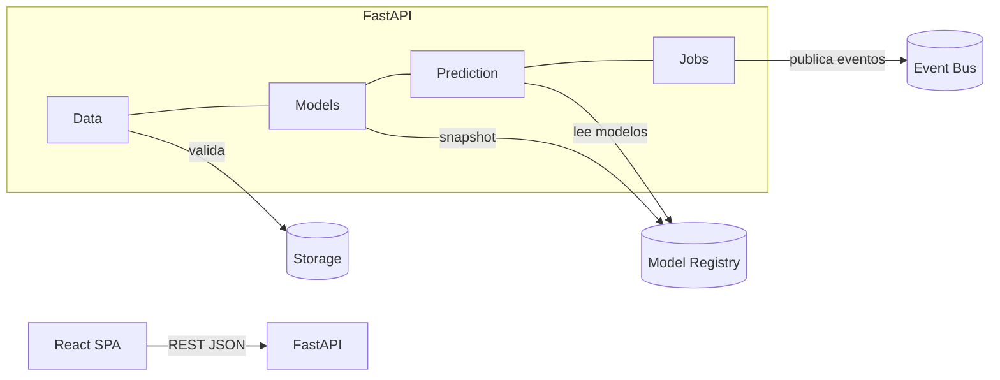

# Arquitectura — NeuroCampus (Día 2)
<!--
Objetivo del día 2:
- Ampliar la arquitectura con los esquemas de datos y la capa de ingesta.
- Documentar el flujo de datos y aclarar el tratamiento de los comentarios cualitativos.
-->

## 1. Visión general
- **Dominio**: análisis educativo (datasets, modelos, predicción, jobs).
- **Estilo**: servicios modulares (FastAPI) + SPA (React/Vite).
- **Tronco común**: contratos HTTP con JSON (+ TypeScript types para FE).

## 2. Capas y módulos
- **Data** (ingesta/validación): adapters a almacenamiento, validaciones, esquemas JSON.
- **Models** (entrenamiento/publicación): ciclo de vida del modelo.
- **Prediction** (online/batch): entradas limpias → salidas con postproceso.
- **Jobs** (orquestación/estado): seguimiento de tareas asíncronas.

## 3. Patrones (acordados)
- **Strategy**, **Template Method**, **Facade**, **Chain of Responsibility**, **Observer**, **Command**, **Adapter**.
<!-- Nota: se detallarán con ejemplos en días 2–6. -->

## 4. Diagramas (borradores)
### 4.1 Componentes (mermaid)

---

## 5. Ingesta sin SQL (Día 2)
- La UI (DataUpload) consulta **GET /datos/esquema** para construir el formulario dinámico.
- **POST /datos/upload** (mock) valida formato mínimo y devuelve `dataset_id` y `rows_ingested` (placeholder).
- Persistencia: **no SQL** por ahora; se utiliza almacenamiento de archivos (CSV/XLSX/Parquet).
- Los esquemas están definidos en `schemas/plantilla_dataset.schema.json` y `schemas/features.quantitativas.json`.

### 5.1 Procesamiento de comentarios (PLN)
- Los campos `comentario.sent_pos`, `comentario.sent_neg` y `comentario.sent_neu` **no forman parte del dataset original**.
- El sistema genera estos valores automáticamente durante la **etapa de Procesamiento de Lenguaje Natural (PLN)**, prevista para el **Día 6**.
- Su cálculo se basa en el texto contenido en la columna `Sugerencias:` de cada registro.
- Los resultados se almacenan como atributos adicionales del dataset procesado y no son requeridos en la validación de `POST /datos/upload`.
- De esta manera se mantiene la separación de responsabilidades:
  - Día 2 → Ingesta y validación del esquema base (sin sentimientos).
  - Día 6 → Análisis de sentimientos y enriquecimiento de los datos.

---

## 6. Próximos pasos
- Día 3: agregar `/datos/validar` con reglas dinámicas.
- Día 4: conectar Jobs y Modelos.
- Día 5: flujo de predicción en frontend.
- Día 6: incorporar análisis de sentimientos (PLN).
