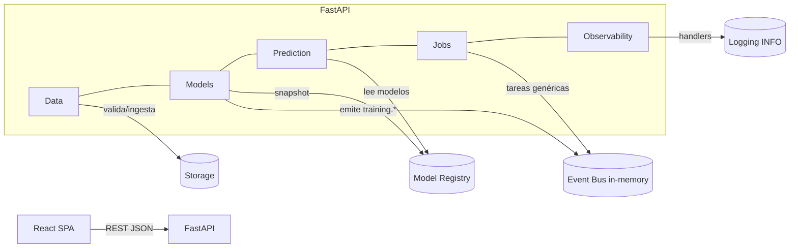
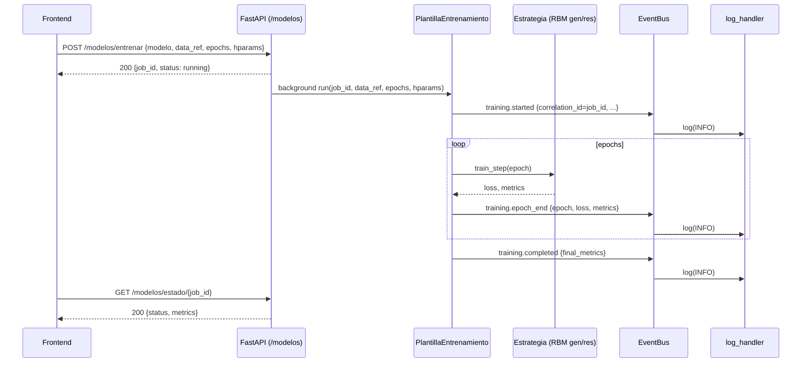
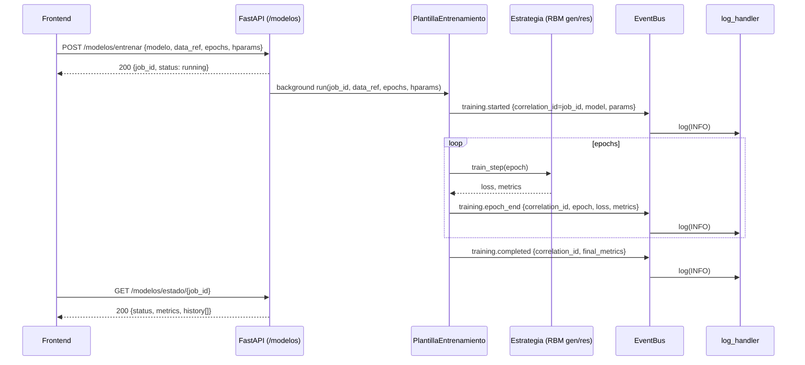

# Apéndice A — Arquitectura (Día 2, referencia histórica)

# Arquitectura — NeuroCampus (Día 2)
<!--
Objetivo del día 2:
- Ampliar la arquitectura con los esquemas de datos y la capa de ingesta.
- Documentar el flujo de datos y aclarar el tratamiento de los comentarios cualitativos.
-->

## 1. Visión general
- **Dominio**: análisis educativo (datasets, modelos, predicción, jobs).
- **Estilo**: servicios modulares (FastAPI) + SPA (React/Vite).
- **Tronco común**: contratos HTTP con JSON (+ TypeScript types para FE).

## 2. Capas y módulos
- **Data** (ingesta/validación): adapters a almacenamiento, validaciones, esquemas JSON.
- **Models** (entrenamiento/publicación): ciclo de vida del modelo.
- **Prediction** (online/batch): entradas limpias → salidas con postproceso.
- **Jobs** (orquestación/estado): seguimiento de tareas asíncronas.

## 3. Patrones (acordados)
- **Strategy**, **Template Method**, **Facade**, **Chain of Responsibility**, **Observer**, **Command**, **Adapter**.
<!-- Nota: se detallarán con ejemplos en días 2–6. -->

## 4. Diagramas (borradores)
### 4.1 Componentes (mermaid)

---

## 5. Ingesta sin SQL (Día 2)
- La UI (DataUpload) consulta **GET /datos/esquema** para construir el formulario dinámico.
- **POST /datos/upload** (mock) valida formato mínimo y devuelve `dataset_id` y `rows_ingested` (placeholder).
- Persistencia: **no SQL** por ahora; se utiliza almacenamiento de archivos (CSV/XLSX/Parquet).
- Los esquemas están definidos en `schemas/plantilla_dataset.schema.json` y `schemas/features.quantitativas.json`.

### 5.1 Procesamiento de comentarios (PLN)
- Los campos `comentario.sent_pos`, `comentario.sent_neg` y `comentario.sent_neu` **no forman parte del dataset original**.
- El sistema genera estos valores automáticamente durante la **etapa de Procesamiento de Lenguaje Natural (PLN)**, prevista para el **Día 6**.
- Su cálculo se basa en el texto contenido en la columna `Sugerencias:` de cada registro.
- Los resultados se almacenan como atributos adicionales del dataset procesado y no son requeridos en la validación de `POST /datos/upload`.
- De esta manera se mantiene la separación de responsabilidades:
  - Día 2 → Ingesta y validación del esquema base (sin sentimientos).
  - Día 6 → Análisis de sentimientos y enriquecimiento de los datos.

---

## 6. Próximos pasos
- Día 3: agregar `/datos/validar` con reglas dinámicas.
- Día 4: conectar Jobs y Modelos.
- Día 5: flujo de predicción en frontend.
- Día 6: incorporar análisis de sentimientos (PLN).

# Arquitectura — NeuroCampus (v0.4.0 con Apéndice Día 2)

Primero la arquitectura **v0.4.0 (vigente)** y al final un **Apéndice** con la versión **Día 2** completa, sin cambios.

---

# Arquitectura — NeuroCampus (v0.4.0, Día 4)

<!--
Objetivo del Día 4:
- Establecer la plantilla de entrenamiento (Template Method) y estrategias de modelo (RBM general/restringida).
- Conectar eventos de observabilidad `training.*` al flujo de entrenamiento.
- Alinear contratos de API con `/modelos/entrenar` y `/modelos/estado/{job_id}`.
-->

## 1. Visión general
- **Dominio**: análisis educativo (datasets, modelos, predicción, jobs).
- **Estilo**: servicios modulares (FastAPI) + SPA (React/Vite).
- **Tronco común**: contratos HTTP con JSON (+ TypeScript types para FE).
- **Observabilidad (nuevo D4)**: bus de eventos **in-memory** (pub/sub) que emite `training.*` durante el entrenamiento; destino por defecto a **logging**.

## 2. Capas y módulos
- **Data** (ingesta/validación): adapters a almacenamiento, validaciones, esquemas JSON.
- **Models** (entrenamiento/publicación): **Plantilla de entrenamiento** + **Estrategias** (RBM general/restringida). Emite `training.*`.
- **Prediction** (online/batch): entradas limpias → salidas con postproceso.
- **Jobs** (orquestación/estado): seguimiento de tareas **genéricas**. *Para entrenamientos, el estado visible vive en `/modelos/estado/{job_id}` en v0.4.0.*
- **Observability** (nuevo): bus de eventos y destinos (p. ej. `log_handler`).

## 3. Patrones (acordados)
- **Template Method** (orquestación de entrenamiento).
- **Strategy** (RBM general vs RBM restringida).
- **Observer** (eventos `training.*` a través del bus).
- **Facade**, **Chain of Responsibility**, **Command**, **Adapter**.

## 4. Diagramas (actualizados D4)

### 4.1 Componentes (mermaid)

### 4.2 Secuencia — Entrenamiento RBM con observabilidad

## 5. Ingesta sin SQL (Día 2) — **se mantiene**
- La UI (DataUpload) consulta **GET /datos/esquema** para construir el formulario dinámico.
- **POST /datos/upload** valida formato mínimo y devuelve `dataset_id` y `rows_ingested` (placeholder).
- Persistencia: **no SQL** por ahora; se utiliza almacenamiento de archivos (CSV/XLSX/Parquet).
- Esquemas en `schemas/plantilla_dataset.schema.json` y `schemas/features.quantitativas.json`.

### 5.1 Procesamiento de comentarios (PLN)
- Los campos de sentimiento no forman parte del dataset original; se calculan en **Día 6** con PLN a partir de `Sugerencias:` y se añaden como enriquecimiento.

## 6. Observabilidad de entrenamiento (nuevo D4)
- **EventBus in-memory** (pub/sub) publica eventos:
  - `training.started` → `{ correlation_id, model, params }`
  - `training.epoch_end` → `{ correlation_id, epoch, loss, metrics }`
  - `training.completed` → `{ correlation_id, final_metrics }`
  - `training.failed` → `{ correlation_id, error }`
- **Destinos**: `log_handler` (INFO). El bus es intercambiable por Kafka/Rabbit en producción.
- **Resiliencia**: los handlers no interrumpen el entrenamiento si fallan (best-effort).
- **Correlación**: `correlation_id == job_id` para seguimiento en logs/UI.

## 7. API y contratos relevantes (v0.4.0)
- **POST `/modelos/entrenar`**: lanza entrenamiento en background con una estrategia RBM (general o restringida).
- **GET `/modelos/estado/{job_id}`**: expone estado y últimas métricas.
- **/jobs**: permanece para **tareas genéricas** (sin cambios vs v0.3.0). Para entrenamientos, el FE consulta `/modelos/estado`.
- Ver detalle en `docs/api.md` (v0.4.0).

## 8. Decisiones y no-funcionales
- **Simplicidad de despliegue**: EventBus in-memory y destino logging por defecto.
- **Intercambiabilidad**: la plantilla no conoce los detalles de RBM (Strategy).
- **Privacidad**: eventos no incluyen datos sensibles ni muestras; solo metadatos/estadísticas.
- **Extensibilidad**: añadir más destinos (p. ej. métricas en Prometheus, colas externas) sin tocar el template.

## 9. Integración Frontend (guía breve)
- **Lanzar**: usar `POST /modelos/entrenar` (apiClient), capturar `job_id`.
- **Progreso**: `GET /modelos/estado/{job_id}` con *polling* (p. ej., 1–2 s) hasta `completed|failed`.
- **UI**: mostrar curva de `loss/recon_error` por epoch (Día 4 B) y estado del job.
- **Errores**: si `failed`, presentar `error` con opción de reintento.

## 10. Próximos pasos
- **Día 5**: flujo de **Predicción** en frontend (inputs → `/prediction`).
- **Día 6**: incorporar **PLN** (sentimientos) y enriquecer dataset/visualizaciones.
- **Día 6–7**: evaluar sinks de observabilidad (Prometheus/Grafana, Kafka) y dashboard de Jobs.

## Anexo — Cambios acumulados Día 4 (v0.4.0)
> Fecha de actualización: 2025-10-10 14:15:36

Este anexo se agrega **al final** del documento existente y detalla los cambios
introducidos el **Día 4** para alinear Arquitectura con la implementación actual
(Plantilla de Entrenamiento + Estrategias RBM + Observabilidad `training.*`).

## 1) Objetivos y alcance (Día 4)
- **Objetivo**: Establecer la **PlantillaEntrenamiento** (Template Method) y las **Estrategias** de modelo (RBM general/restringida), conectadas a un **EventBus in-memory** que publica eventos `training.*` durante el ciclo de entrenamiento.
- **Listo cuando**: El **flujo de entrenamiento** y las **métricas/eventos** están documentados y conectados con los **contratos de API** expuestos por `/modelos`.

## 2) Componentes introducidos/actualizados
- **Models**
  - `PlantillaEntrenamiento`: orquesta `epochs`, recibe una `EstrategiaEntrenamiento` y emite eventos.
  - `RBMGeneral` / `RBMRestringida`: implementan `setup()` y `train_step()` (CD-k).
- **Observability**
  - `EventBus` (pub/sub in-memory) y `log_handler` (sink por defecto).
  - Eventos: `training.started`, `training.epoch_end`, `training.completed`, `training.failed`.
- **API / Routers**
  - `/modelos/entrenar` (POST) lanza el job y devuelve `job_id`.
  - `/modelos/estado/{job_id}` (GET) consolida `status`, `metrics` y `history[]` desde eventos.
- **Frontend**
  - Vista **Models**: lanza entrenamiento y grafica curva `recon_error` por época.

## 3) Patrones (Día 4)
- **Template Method**: `PlantillaEntrenamiento.run()` controla el ciclo y emite eventos.
- **Strategy**: `RBMGeneral` / `RBMRestringida` encapsulan el algoritmo (RBM con CD-k).
- **Observer**: `EventBus` suscribe handlers (logging) sin acoplarse a la plantilla.
- **Adapter / Facade**: Routers para simplificar el acceso desde FE.

## 4) Diagramas (Mermaid)

### 4.1 Componentes (actualizado D4)

### 4.2 Secuencia — Entrenamiento RBM + eventos

## 5) Contratos relevantes y trazabilidad
- **POST `/modelos/entrenar`**: inicia job y conecta `correlation_id == job_id` para eventos.
- **GET `/modelos/estado/{job_id}`**: agrega `history[]` (un punto por `epoch_end`) y snapshot de `metrics` (o `final_metrics`).
- **Hparams**: normalizados a *minúsculas* en el router para robustez.
- Ver detalle de campos/ejemplos en **docs/api.md (v0.4.0)**.

## 6) Decisiones no‑funcionales (D4)
- **Simplicidad**: EventBus in-memory y logging como sink por defecto.
- **Resiliencia**: un handler fallido no detiene el entrenamiento (best‑effort).
- **Privacidad**: eventos no cargan datos sensibles; solo metadatos y métricas.
- **Extensibilidad**: futuros sinks (Prometheus/Grafana, Kafka/Rabbit) y más estrategias de modelo sin cambiar la plantilla.

## 7) Integración Frontend
- Lanza entrenamiento → `POST /modelos/entrenar` → recibe `job_id`.
- Polling → `GET /modelos/estado/{job_id}` cada 1–2 s hasta `completed|failed`.
- UI muestra: `status`, `job_id`, curva `recon_error`/`loss`, y errores si los hay.

## 8) Compatibilidad
- Se conserva el diseño de **Día 2–3** (ingesta y validación) sin cambios de ruptura.
- `/jobs` sigue disponible para tareas genéricas; el estado de entrenamiento se consulta en `/modelos/estado`.
