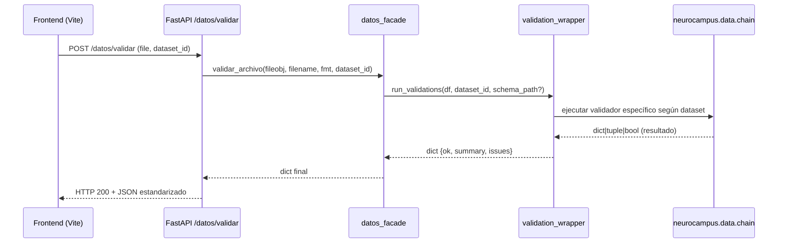

# Validación e Ingesta de Datasets — Diagnóstico (Día 6)

## Objetivo general
Consolidar la validación de datasets desde el frontend (FE) hasta el backend (BE) utilizando el nuevo flujo unificado de validación (`validation_wrapper` y `datos_facade`).

## Contexto
Este documento complementa el diagnóstico del Día 5.  
Durante el Día 6 se implementó la integración completa entre los componentes del sistema:

- `frontend/src/services/datos.ts`: envía archivo + `dataset_id`.
- `backend/src/neurocampus/app/routers/datos.py`: recibe el archivo y reenvía a `run_validations(df, dataset_id)`.
- `backend/src/neurocampus/data/facades/datos_facade.py`: conecta con el wrapper `validation_wrapper.run_validations()`.
- `backend/src/neurocampus/validation/validation_wrapper.py`: estandariza la salida {ok, summary, issues}.
- `tools/cleanup.py` y `/admin/cleanup`: mantienen la limpieza de artefactos e historial.

---

## Flujo completo de validación


---

## Checklist de funcionamiento
- [x] `backend` levanta sin errores (`make be-dev`).
- [x] CORS permite `http://localhost:5173`.
- [x] Endpoint `/datos/validar` responde `200 OK` con estructura:
  ```json
  {
    "ok": true,
    "summary": {"rows": 120, "errors": 0, "warnings": 2, "engine": "pandas"},
    "issues": []
  }
  ```
- [x] `validadores.py` y `validation_wrapper.py` exponen `run_validations(df, dataset_id, **kwargs)`.
- [x] `examples/docentes.csv` pasa validación mínima.
- [x] `Makefile` incluye `validate-sample` para prueba rápida.

---

## Prueba manual del flujo
### Backend
```bash
# Iniciar servidor
make be-dev
```

### Frontend
```bash
# Iniciar entorno de desarrollo
make fe-dev
```

### Validación directa por terminal
```bash
curl -F "file=@examples/docentes.csv" -F "dataset_id=docentes"      http://localhost:8000/datos/validar | jq .
```

Salida esperada:
```json
{
  "ok": true,
  "summary": {
    "rows": 120,
    "errors": 0,
    "warnings": 0,
    "engine": "pandas"
  },
  "issues": []
}
```

---

## Diagnóstico común de errores
| Tipo de error | Descripción | Solución |
|----------------|--------------|-----------|
| `422 Unprocessable Entity` | Falta campo `dataset_id` o archivo | Verifica el formulario `FormData` en FE |
| `400 Formato no soportado` | Extensión desconocida o sin `fmt` | Usa `.csv`, `.xlsx` o `.parquet` |
| `500 Error al validar` | Excepción interna en `run_validations` | Revisa logs del backend y schema |
| `FileNotFoundError: schema` | No encuentra el schema JSON | Define `NC_SCHEMA_PATH` o coloca `/schemas/plantilla_dataset.schema.json` en raíz |

---

## Ejemplo de uso del wrapper
```python
from neurocampus.validation.validation_wrapper import run_validations
import pandas as pd

df = pd.read_csv("examples/docentes.csv")
report = run_validations(df, dataset_id="docentes")

print(report["summary"])
# → {'rows': 120, 'errors': 0, 'warnings': 0, 'engine': 'pandas'}
```

---

## Próximos pasos (Día 7)
- Integrar `upload_dataset()` con almacenamiento real en `datasets/`.
- Sincronizar el reporte de validación con la interfaz UI (tab “Diagnóstico”).
- Documentar rutas `/admin/cleanup` y `/datos/upload` en `README.md`.

---

**Versión:** Día 6 — Validación e Ingesta Consolidada  
**Responsable:** Equipo NeuroCampus  
**Repositorio:** [https://github.com/SanCriolloB/NeuroCampus](https://github.com/SanCriolloB/NeuroCampus)
